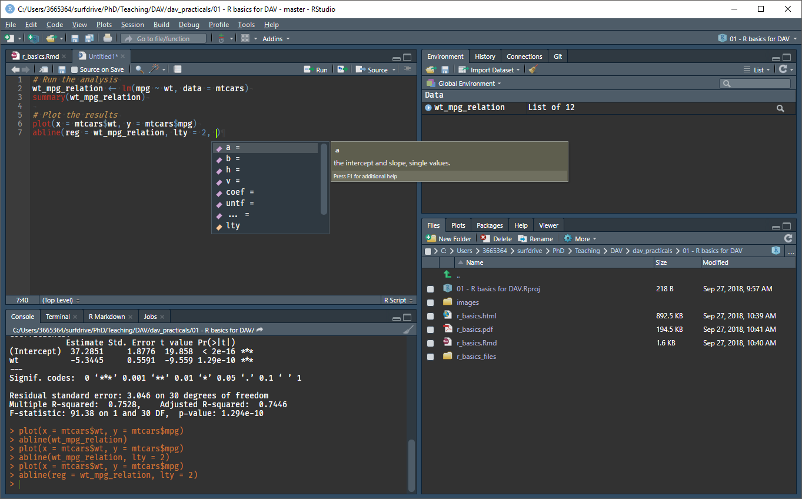

# Introduction

Welcome to the DAV practicals. In the practicals we will get hands-on experience with the materials in the lectures by programming in `R` and completing assignments. This is the first practical. In this practical, we will briefly introduce how we are going to work with `R` and `RStudio` for the remainder of the course. This first practical is meant to get everyone up to speed on our workflow. 

- Make sure you have read and comply with the [prerequisites](https://vankesteren.github.io/dav_practicals/#prerequisites).
- Read through the [outline](https://vankesteren.github.io/dav_practicals/#outline-of-the-practicals) of the practicals. Note that in some weeks we do more than 1 practical and that assignments are due in week 3 and 10.
- You may skip the first two sections if you already know about them.


# R and RStudio

In this course we are going to use the open-source programming language `R`. is focussed on statistics and data analysis, with several built-in options and example datasets for performing most common types of analysis. For example, we can perform a regression and plot it to show the relationship between weight and miles per gallon of the cars in the built-in `mtcars` dataset:

```{r lm_into}
result <- lm(mpg ~ wt, data = mtcars)
plot(mpg ~ wt, data = mtcars)
abline(reg = result, lty = 2)
```


RStudio is the de-facto standard integrated development environment (IDE) for `R`: a computer program that enables us to easily write programs, scripts, documents, and even entire blogs, websites, and journal articles using `R` in the background. 

---

1. __Open RStudio on your computer, and go to Tools > Global options to change the appearance settings to your preference__

---



Rstudio has four main panes. In the top-left, there is the source pane. Here, any open document or `R` script can be viewed and edited, just like any regular text editor. This is where we will do most of our programming. On the bottom left, we have our actual `R` session, the console. Typing `R` commands in this window will actually perform them. Pressing "run" in the source pane (or ctrl/cmd + enter) will send any commands currently selected in the source pane to the console to be executed.

The top-right pane holds the environment. Any objects and variables created by running code will appear here for closer inspection.

In the bottom right, there is a pane with several tabs: the plots tab shows any plot created in the console, the files tab shows the current working directory, and the help tab shows documentation and help pages for functions and packages.


# Help files

Functions are embedded within `packages`. An example of a package that comes with your installation of `R` is `stats`, which contains a variety of statistical functions. Any functions we will be using has documentation, which can be reached using the function `help()` or through the question mark `?`. 

---

2. __Run the following in the R console__

---

```{r help, eval = FALSE}
?t.test
```

The help file will open in the bottom-right help pane, which shows how the function `t.test()` should be used. Help files usually contain what the arguments (input) mean, what the value (output) is, some details about its implementation, some related functions (in this case `prop.test`), and even some usage examples. Not all help files are this complete, but most give enough information to run the specific function you are interested in. 

---

3. __Get familiar with help files by searching for a few more functions, such as `plot()`, `lm()`, and `print()`__

---

Everyone uses help files extensively, even the most prolific `R` programmers. 

---

4. __Try to find out what the `prop.table()` function does by searching for it on the internet__

---

Everyone uses internet search extensively, even the most prolific `R` programmers. Don't be afraid to copy and paste.


# Projects

A feature we are going to use a lot is RStudio's projects. A project is a file folder with code, data, and other files related to a single project. An `R` project folder contains an `.Rproj` file which you can open from `RStudio`. This automatically sets that folder as the working directory, meaning any files in it can be loaded relative to this directory. 

---

5. __Open the file `01 - R basics for DAV.Rproj` in RStudio and run the following code in the console. Do you know where the file "sometext.txt" is located on your disk?__

---

```{r readlines, eval = FALSE}
print(readLines("data/sometext.txt"))
```

After opening an `R` project, RStudio shows the name of the project in the top-right corner of the program, above the environment panel. By clicking on it, you can close it, open another project, create new projects, and quickly access your latest projects. You can also open projects in new RStudio sessions.

```{r proj, out.width = "40%", echo = FALSE, fig.align = 'center'}
knitr::include_graphics("images/projects.png")
```

---

6. __In this course (and beyond!), always work in a project. For the remainder of this practical, we will work in the project `01 - R basics for DAV`.__

---


# R Markdown

In this course, we will do most of our programming in `.Rmd` files, R Markdown files. With R Markdown files, we can easily create documents which seamlessly combine text, code, and plots. The document you are reading right now was generated from an R Markdown file.

---

7. __Open the file `r_basics.Rmd` from the Files pane in RStudio.__

---

If you scroll through the file, you may see that there is a specific syntax associated with R Markdown files. At the start, there is some information about the document and how it should be output, and in the document itself is the text with a lot of pound signs (`#`), underscores (`_`) and backticks (\`). 

---

8. __Read through the following tutorials on rmarkdown.rstudio.com.__

---

- [How It Works](https://rmarkdown.rstudio.com/lesson-2.html)
- [Code Chunks](https://rmarkdown.rstudio.com/lesson-3.html)
- [Markdown Basics](https://rmarkdown.rstudio.com/lesson-8.html)
- [Output Formats](https://rmarkdown.rstudio.com/lesson-9.html)
- [Cheatsheets](https://rmarkdown.rstudio.com/lesson-15.html)

---

9. __Create a new R Markdown file in RStudio using `File > New File > R Markdown`. Play around with the file that appears.__

---

RStudio may ask you to install several packages. You should allow it to!


---

10. __Make sure you can output the R Markdown file you created to a pdf using `Knit > Knit to pdf` on top of the source pane. If there are errors, you may need to install a TeX distribution.__

---

The assignments in week 3 and week 10 need to be handed in as an R project folder with data, a `.Rmd` file, and the `.pdf` file generated from it.

From practical 2 onwards, we will always start by opening the R project and do the assignments directly in the R Markdown file. Under each assignment, you can insert an `R` chunk and input your code there. If you prefer, you may also work directly in a `.R` file for the practicals. Note that if you do this, you will still have to work with an `.Rmd` file for the assignments.


# The `ISLR` package

```{r islr_data, echo = FALSE, warning = FALSE}
library(ISLR)
dsets <- paste(ls("package:ISLR"), collapse = ", ")
```

The first book we are using in this course is [Introduction to Statistical Learning](http://www-bcf.usc.edu/~gareth/ISL/), abbreviated as ISLR. The authors use several datasets throughout the book which are packaged in the `R` package `ISLR`. The datasets are: `r dsets`.

---

11. __Install and load the package in `R` by running the following in the console__

---

```{r install_islr, eval = FALSE}
install.packages("ISLR")
library(ISLR)
```

---

12. __Look at the Default dataset by running the following in the console. What does this dataset contain?__

---

```{r default, eval = FALSE}
View(Default)
```


# The tidyverse

The second book we are using in this course is [Hadley Wickham's R for Data Science](http://r4ds.had.co.nz/), or R4DS. Nice to know: this entire book and its website were made using R Markdown! Hadley Wickham and R4DS use a specific _dialect_ of `R`, a set of packages called the tidyverse. Because these packages are very useful and great for data science, we will be using the tidyverse throughout this course.

---

13. __Install and load the packages from the tidyverse by running the following in the console__

---

```{r install_tidy, eval = FALSE}
install.packages("tidyverse")
library(tidyverse)
tidyverse_packages()
```

You can see that tidyverse contains many packages, some of which are loaded by default when tidyverse is loaded. In the next practical, we are going to learn about how to use `readr` and `haven` for importing data and `dplyr` for data manipulation.

# Code style

Throughout this course, try to maintain a consistent and legible style for your code. This is very important as it will make your collaborators, as well as future you happy. Being able to read and understand your own code after a year of not looking at it is possible if you use consistent style and informative comments where necessary. 

---

14. __Read through the [Google style guide](https://google.github.io/styleguide/Rguide.xml) for R__

---

The most obvious deviation we will make from the google style guide is in naming things: `object_name` for variables and `do_something()` for functions are how we will be programming. Try to adhere to this style for your assignments, too. Tip: in RStudio, you can display a vertical line at 80 characters to know when your code exceeds this. You can do this at Tools > Global Options > Code > Display > Show margin.


# Conclusion

If you have followed this practical, you are all set for the remainder of this course! For the next practical (also in this week!), open the file `02 - Data manipulation.Rproj` from its folder and then, from the Files pane, open the `.Rmd` file.


